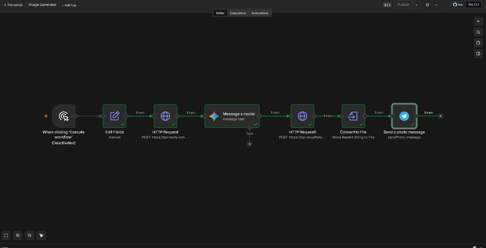

# n8n--image-generation

An automated, multi-step AI workflow built in **n8n** that researches a topic, writes a social-media post, generates a matching image, and delivers the finished result — all from a single trigger.

This project demonstrates **AI agent orchestration**, **real API integration**, and a **human-in-the-loop** design where nothing is published without review.

---

## 📸 Workflow Overview



> The full pipeline running end-to-end — every step completes successfully (green checks).

---

## ✨ What It Does

Give the workflow a **topic**, and it automatically:

1. 🔍 **Researches** the topic on the web for real, up-to-date facts
2. ✍️ **Writes** a short, cheerful post using a large language model
3. 🎨 **Generates** a custom image to match the content
4. 🖼️ **Converts** the generated image into a usable file
5. 📮 **Delivers** the finished post and image to a Telegram chat for review

---

## 🛠️ Tech Stack

All tools used have free tiers — **no paid services required.**

| Step | Tool | Role |
|------|------|------|
| Automation engine | **n8n** (self-hosted) | Connects every step together |
| Web research | **Tavily Search API** | Finds real facts about the topic |
| Text generation | **Google Gemini API** | Writes the post |
| Image generation | **Cloudflare Workers AI** (FLUX.1) | Draws a matching image |
| Delivery | **Telegram Bot API** | Sends the result for approval |

---

## 🔁 Pipeline Steps

```
Trigger → Set Topic → Research (Tavily) → Write (Gemini)
        → Generate Image (Cloudflare) → Convert to File → Send to Telegram
```

Each node passes its output to the next, so the post and image stay grounded in the original topic.

---

## 🧠 Key Design Choices

- **Human-in-the-loop:** The pipeline sends the finished content for review rather than auto-publishing — a responsible-AI approach.
- **Structured prompting:** The language model is prompted to return a clear, usable post (title, body, hashtags).
- **Original content only:** Image prompts avoid copyrighted characters and generate original artwork, following content best practices.
- **Security first:** All API keys and tokens are stored as private credentials inside n8n and are **never** committed to this repository.

---

## 🚀 How to Run It

1. Install and run **n8n** (self-hosted Community edition is free).
2. Import the workflow file into n8n.
3. Add your own free API credentials for Tavily, Gemini, Cloudflare, and Telegram.
4. Set a topic and run the workflow.

> ⚠️ **Note:** API keys are intentionally excluded from the workflow file for security. You'll need to add your own.

---

## 📚 What I Learned

- Building multi-step AI agent workflows with n8n
- Integrating multiple real-world APIs (search, LLM, image generation, messaging)
- Handling and converting API data formats (Base64 → image file)
- Debugging real errors (authentication, webhooks, data fields)
- Following security best practices by keeping secrets private

---

## 📝 License

Free to use and learn from. Built as a learning and portfolio project.
